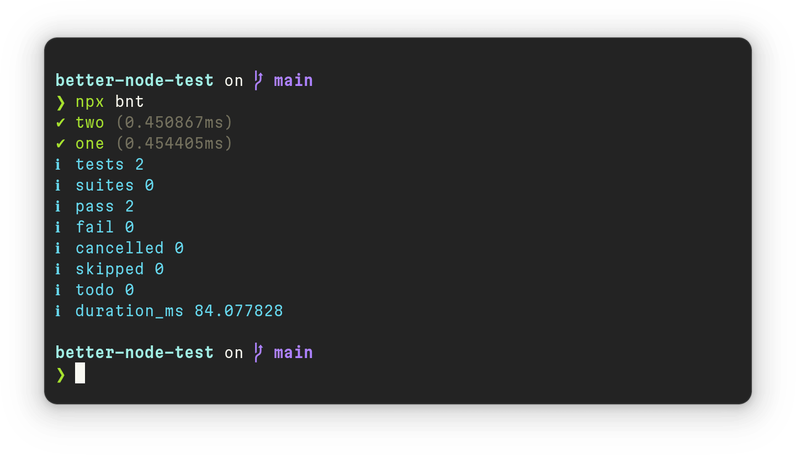

# Better Node Test

The CLI shortcut for [`node --test`](https://nodejs.org/api/test.html) with:

* **TypeScript** support.
* `-t` **shortcut** to run special test.

<p align="center">
  
</p>

---

  Made in <b><a href="https://evilmartians.com/devtools?utm_source=nanoid&utm_campaign=devtools-button&utm_medium=github">Evil Martians</a></b>, product consulting for <b>developer tools</b>.

---

## Usage

Install CLI:

```sh
npm install --save-dev better-node-test
```

For TypeScript you will also need `tsm`:

```sh
npm install --save-dev better-node-test tsm
```

To run all tests with `*.test.ts` or `*.test.js`:

```sh
npx bnt
```

To run special test:

```sh
npx bnt ./test/request.test.ts -t 'uses HTTPS'
```
