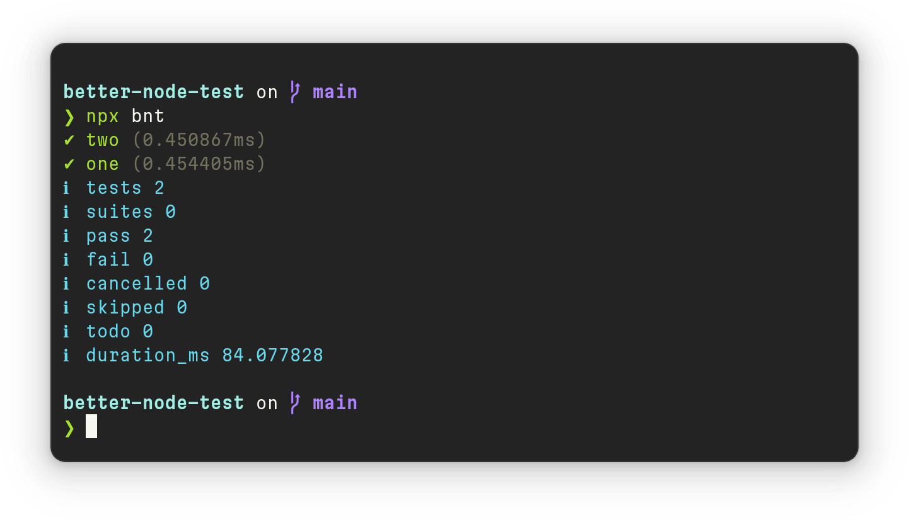

# Better Node Test

The CLI shortcut for [`node --test`](https://nodejs.org/api/test.html) with:

* **TypeScript** support.
* `-t` **shortcut** to run special test.
* `--coverage` to check test coverage.

<p align="center">
  
</p>

---

  Made at <b><a href="https://evilmartians.com/devtools?utm_source=nanoid&utm_campaign=devtools-button&utm_medium=github">Evil Martians</a></b>, product consulting for <b>developer tools</b>.

---

## Install

```sh
npm install --save-dev better-node-test
```

## Usage

To run all tests with `*.test.ts` or `*.test.js`:

```sh
npx bnt
```

To run special test:

```sh
npx bnt ./test/request.test.ts -t 'uses HTTPS'
```

To run test coverage:

```sh
npx bnt --coverage 100 --coverage-exclude '**/*.test.*'
```

Use `/* node:coverage ignore next 2 */` comments to ignore lines.
